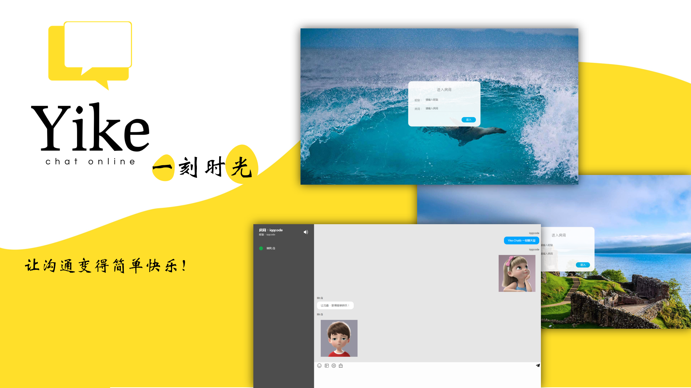
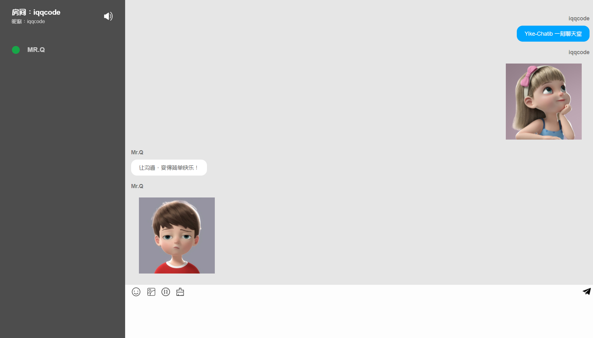

# Yike-Chatib

**🔊Yike一刻聊天室，让沟通变得简单快乐！💌**

 

  
  

## 项目简介

【Yike-Chatib】一刻时光是基于WebSocket实现的一款即时便捷、高效易用的通讯聊天室

- **即时通讯软件**

- **即时便捷、简单高效**

做项目的初心就是做一款即时沟通的软件。就像弹幕一样，大家可以在同一个话题下快乐的交流，不用繁琐的注册登录、不需要知道对方的QQ微信等联系方式，简单高效的交流，回归沟通的简单和快乐。

## 应用技术

**开发文档📚[https://iqqcodes.gitee.io/coan](https://iqqcodes.gitee.io/coan)**

**SpringBoot + WebSocket + Layui + jQuery + Gson**

## 功能实现

- [x] 无需注册，易用便捷

- [x] 支持公开/加密来创建聊天室

- [x] 支持消息群发和私发

- [x] 上线/下线信息提示，消息提醒

- [x] 聊天方式多样化，可发送表情包、消息动画、图片发等

- [x] 壁纸切换

- [x] 聊天室无人数限制

## 改进和优化

**Release 1.0**🔉[IM网页即时聊天室📝](https://github.com/IQQcode/Chatib)

**在Chatib1.0上做的优化**

- 省去用户登录注册，便捷聊天，即在眼前

- 新增聊天Room，可设置公开/加密权限

- UI界面全新优化，更加简洁美观

- 多样化的聊天方式等你来探索

- 信息提示音，再也不拍消息错过

- 全新的壁纸切换

## 应用

- 博客系统作配合评论做沟通版块
- 实时聊天、匿名沟通

## 项目预览

创建Room

趣味聊天

## 项目部署

### 安装教程

1. maven打包
2. 部署到Tomcat

### 使用说明

1. 后台暂无数据库，不保留用户聊天数据；
2. 图片最大只能发送1M的，格式为常见图片格式；
3. 用户发送的图片会在服务器上短暂储存供其他用户加载，约一分钟后会被删除；
4. 打开项目后输入任意昵称和房间号即可进入指定房间，也可选择已存在的房间，同一房间中昵称不可重复；
5. 标签页不在前台时收到消息会有提示音和弹窗通知，用户可根据需要开启/关闭此功能，开关是侧边栏上方的音量按钮。
