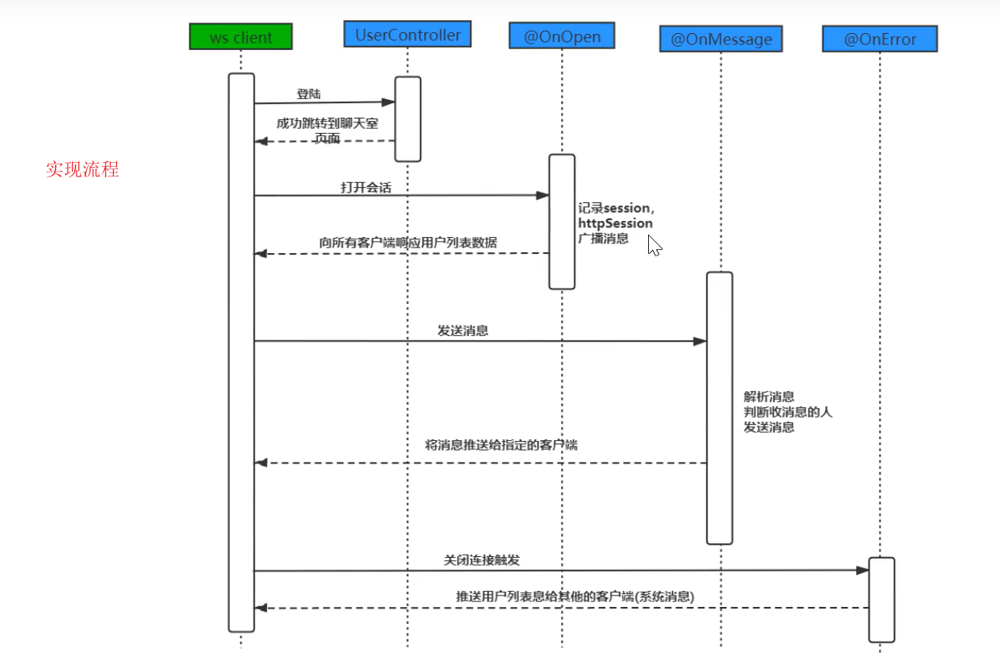
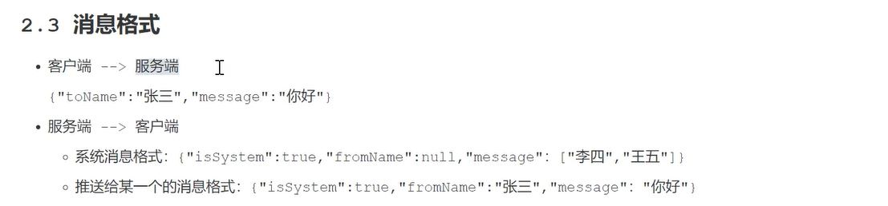

> @OnError改为Close



客户端发送：

- JSON格式，给谁发、发送内容

服务器推送：

- 系统消息：消息推送，所有用户
- 私发推送：具体用户

### spring boot 集成 websocket

**pom.xml**

```java
<dependency>
  <groupId>org.springframework.boot</groupId>
  <artifactId>spring-boot-starter-websocket</artifactId>
</dependency>
```

**WebSocketConfig**

```java
package cn.coder4j.study.example.websocket.config;

import org.springframework.context.annotation.Bean;
import org.springframework.context.annotation.Configuration;
import org.springframework.web.socket.config.annotation.EnableWebSocket;
import org.springframework.web.socket.server.standard.ServerEndpointExporter;

/**
 * @author buhao
 * @version WebSocketConfig.java, v 0.1 2019-10-18 15:45 buhao
 */
@Configuration
@EnableWebSocket
publicclass WebSocketConfig {

    @Bean
    public ServerEndpointExporter serverEndpoint() {
        returnnew ServerEndpointExporter();
    }
}
```

说明：

这个配置类很简单，通过这个配置SpringBoot才能去扫描后面的关于 websocket 的注解。

**MyWebSocket**

我们要将`MyWebSocket`对象交给Spring容器来管理，所以添加`@Component`，添加配置类`MyWebSocket`来注入

```java
@ServerEndpoint(value = "/websocket")
@Component
public class MyWebSocket {

    /**
     * 连接成功
     *
     * @param session
     */
    @OnOpen
    public void onOpen(Session session) {
        System.out.println("连接成功");
    }

    /**
     * 连接关闭
     *
     * @param session
     */
    @OnClose
    public void onClose(Session session) {
        System.out.println("连接关闭");
    }

    /**
     * 接收到消息
     *
     * @param text
     */
    @OnMessage
    public String onMsg(String text) throws IOException {
        return"servet 发送：" + text;
    }
}
```

注入ServerEndpointExporter bean对象，自动注册使用了@ServerEndpoint注解的bean

```java
@Configuration
public class WebSocketConfig {
    @Bean
    //注入ServerEndpointExporter bean对象，自动注册使用了@ServerEndpoint注解的bean
    public ServerEndpointExporter serverEndpointExporter() {
        return new ServerEndpointExporter();
    }

}
```


**说明**

这里有几个注解需要注意一下，首先是他们的包都在 **javax.websocket **下。并不是 spring 提供的，而 jdk 自带的，下面是他们的具体作用。

1. **@ServerEndpoint**
2. 通过这个 spring boot 就可以知道你暴露出去的 ws 应用的路径，有点类似我们经常用`@RequestMapping`。比如你的启动端口是 8080，而这个注解的值是 ws，那我们就可以通过 `ws://127.0.0.1:8080/ws` 来连接你的应用
3. **@OnOpen**
4. 当 websocket 建立连接成功后会触发这个注解修饰的方法，注意它有一个  Session 参数
5. **@OnClose**
6. 当 websocket 建立的连接断开后会触发这个注解修饰的方法，注意它有一个  Session 参数
7. **@OnMessage**
8. 当客户端发送消息到服务端时，会触发这个注解修改的方法，它有一个 String 入参表明客户端传入的值
9. **@OnError**
10. 当 websocket 建立连接时出现异常会触发这个注解修饰的方法，注意它有一个  Session 参数

另外一点就是服务端如何发送消息给客户端，服务端发送消息必须通过上面说的 Session 类，通常是在@OnOpen 方法中，当连接成功后把 session 存入 Map 的 value，key 是与 session 对应的用户标识，当要发送的时候通过 key 获得 session 再发送，这里可以通过  **session.getBasicRemote\*()\*.sendText\*(*)** 来对客户端发送消息。


------------------

【参考文章】

- [Spring WebSocket Support](https://docs.spring.io/spring/docs/current/spring-framework-reference/html/websocket.html)

- [WebSocket教程](http://www.ruanyifeng.com/blog/2017/05/websocket.html)
- [Node.js + WebSocket打造及时聊天程序嗨聊](http://www.cnblogs.com/Wayou/p/hichat_built_with_nodejs_socket.html)